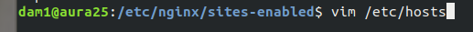

Para el proyecto he elegido un reloj analógico https://github.com/Metroxe/one-html-page-challenge/blob/master/entries/clock.html 
y un tanque de peces interactivo https://github.com/Metroxe/one-html-page-challenge/blob/master/entries/fishies.html.

El proyecto parte de instalar el servidor mediante sudo apt nginx install e irse al directorio de configuración.

Ya estando ahí nos vamos a sites available con cd, lo cual nos permitirá acceder a los archivos de configuración de las webs del servidor, tendrá una llamada default, lo copiamos y lo modificamos para tener los dos dominios disponibles.

Ya teniéndolos los modificamos con toda la información necesaria: nombre del dominio (server\_name) y root ( código fuente del archivo html).

Teniendo esto no será suficiente, necesitaremos crear un link a estos archivos en el directorio de sites available, para esto necesitaremos el comando ln -s.

Finalmente será necesario editar el archivo de hosts para relacionar las direcciones de dominio que hayamos elegido con nuestra ip local (para que no las detecte como páginas web externas).

 

Ya teniendo esto reiniciamos el servicio de hosts y de nginx, tras eso podremos acceder a las páginas sin problema.

